# Aishik Sanyal

## // about Me

<!-- 

 -->

Independent research engineer focused on testable experiments in **perception**, **attention**, **self-modeling**, **self-organizing learning**, and **foundation-model phenomenology** across classical and alternative computing platforms.

**Experience:**
- Security Engineer @ Canadian Gov, Ex-CTO & Cofounder @ Spiral Works, Ex-SWE @ IBM
- Biology/Neuroscience-inspired ML architecture design
- Computational Creativity based Scientific Idea Generation
- Agentic AI systems for research automation

**Interests:** Neurophenomenology, philosophy of science, evolutionary biology, theoretical physics, computational neuroscience, consciousness research

### // recent publications

<!-- 

 -->

**Spark: A System for Scientifically Creative Idea Generation** (2025)  
*Proceedings of the 16th International Conference on Computational Creativity (ICCC'25)*  
[arXiv:2504.20090](https://doi.org/10.48550/arXiv.2504.20090)

**Implementation of a Decentralized Traffic Congestion Avoidance Mechanism for VANETs** (2022)  
*ACM International Symposium on Design and Analysis of Intelligent Vehicular Networks (DIVANet '22)*  
[ACM Digital Library](https://dl.acm.org/doi/10.1145/3551662.3560928)

<!-- ## // technical skills

### // core technologies
- **AI/ML:** PyTorch, CUDA, HuggingFace Transformers, Unsloth, LangChain
- **Systems:** FastAPI, Redis, Docker/Kubernetes, Azure, Runpod
- **Languages:** Python, C/C++, JavaScript/TypeScript, Java, Kotlin, Julia, Haskell
- **Research:** Predictive Coding Transformers, Energy-Based Models, TEM, HTM, ART -->

## // languages

## // connect

---

