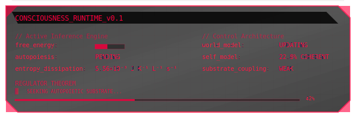

  

## // about Me

Polymath research engineer focused on testable experiments in **perception**, **attention**, **self-modeling**, **world-modeling**, **self-organizing learning**, and **foundation-model phenomenology** across classical and alternative computing platforms.

Testing and engineering agenda for substrate independent consciousness: [Minds Are Software - But Survival Is the Runtime](https://aishiksanyal.substack.com/p/minds-are-software-but-survival-is)

**Experience:**
- Security Engineer @ Canadian Gov, Ex-CTO & Cofounder @ Spiral Works, Ex-SWE @ IBM
- Computational Creativity based scientific idea generation using LLMs
- Agentic AI systems for experiment automation
- ARC-AGI-3 participant: https://three.arcprize.org/leaderboard

### // recent publications

**Spark: A System for Scientifically Creative Idea Generation** (2025)  
*Proceedings of the 16th International Conference on Computational Creativity (ICCC'25)*  
[arXiv:2504.20090](https://doi.org/10.48550/arXiv.2504.20090)

**Implementation of a Decentralized Traffic Congestion Avoidance Mechanism for VANETs** (2022)  
*ACM International Symposium on Design and Analysis of Intelligent Vehicular Networks (DIVANet '22)*  
[ACM Digital Library](https://dl.acm.org/doi/10.1145/3551662.3560928)

<!-- Main Header -->

  

## // technical skills

### // ai/ml

### // systems & cloud

### // architectures

<!--  -->

### // languages

## // connect

---

